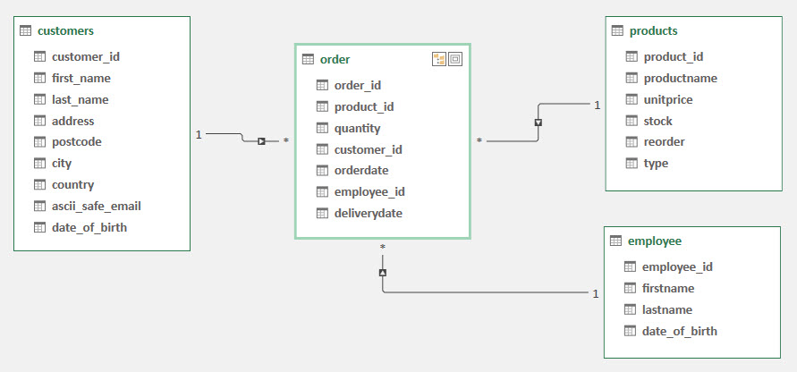

# Fakedata
When teaching, there is often a need for data, it can be for databases or files (*CSV, Excel*) to be imported in e.g. Python to work with those there.

Sometimes it is an advantage if the data has a large "size" other times it is an advantage with "small" amounts of data - Speed.

I have created a Jupyter Lab file that generate "sales data" for a total fictitious business.

[FakerData.ipynb](FakerData.ipynb)

If you prefer the code as a Python (*.py*) file, you can export it from Jupyter Lab.

## Faker
I have usede the Python module **Faker**.

You can read more about this module her: 

- [pypi.org/project/Faker](https://pypi.org/project/Faker/)
- [faker.readthedocs.io](https://faker.readthedocs.io/en/master/index.html)

## Tables
Data consists of 4 "*tables*":
- Customers
- Employee
- Orderlines
- Products - *20 products predefined*

### Relations



## Number of entries
It is possible to control the number of entries in the various tables. 
However, you should be aware that a large number of records will mean that it takes a long time to generate the data.

## Export
You can export to:

- CSV
- Excel
- MySQL on Azure

```
  no_customeres = 20
  no_sales = 5000
  no_employee = 10
```

Product is predefined to 20 products.

## Export
Data is exported to CSV and Excel.

In Excel, it is one Excel file that contains 4 sheets.

### CSV
- customers.csv
- order.csv
- employees.csv
- products.csv

### Excel
- sales_data.xlsx

# Extra links
Some links to OpenData, if you need somthing else :-)

- [UCI -ML](http://archive.ics.uci.edu/ml/datasets.php)
- [DataHub.io](https://datahub.io/collections)
- [FiveThirtyEight](https://data.fivethirtyeight.com)
- [Google Cloud](https://cloud.google.com/bigquery/public-data)
- [Data.gov](https://www.data.gov)
- [Kaggle](https://www.kaggle.com/datasets)
- [BuzzFeed News](https://github.com/BuzzFeedNews)
- [Data.Nasa.gov](https://data.nasa.gov)
- [Nasdaq Data Link](https://data.nasdaq.com/search)
- [GitHub Awesomedata](https://github.com/awesomedata/awesome-public-datasets)
